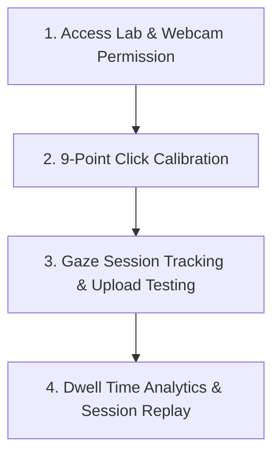

# Product Requirement Document (PRD)
## Platform Feature: Browser-Based Gaze Estimation Lab

**Platform:** Neuromarketing Capsule  
**Owner:** Mahindra Finance Marketing & UX Strategy Team  
**Status:** Approved  
**Version:** 1.0.0 (Internal Release)  

---

### 1. Executive Summary & Goals

The **Gaze Estimation Lab** is an internal enterprise utility designed for Mahindra Finance's rural marketing and product teams. It enables quick, local, and browser-based gaze tracking of advertising creatives, loan prototypes, and onboarding flows. 

Rather than relying on high-cost, specialized, and medical-grade hardware (such as infrared eye tracking bars), this feature uses the user's standard webcam and the **WebGazer.js** regression library to estimate attention points dynamically.

#### Primary Objectives:
- **Democratize Testing**: Allow field officers and creative designers to conduct quick visual-attention sanity checks on any marketing poster or interface.
- **Identify Ignored Zones**: Highlight parts of Mahindra Finance materials (such as critical rural terms, interest disclosures, or CTA buttons) that fail to attract gaze.
- **Assisted Calibration**: Provide non-technical users with an easy, gamified 9-point calibration process that raises gaze precision within web sessions.
- **Privacy First**: Process all video frames strictly on the client side. No video feeds or images are ever uploaded to corporate servers.

---

### 2. Branding & Positioning Directive

> [!IMPORTANT]
> **Branding Terminology Directive**
> To manage expectations with executive stakeholders, this feature is strictly labeled **"Browser-Based Gaze Estimation"**. 
> - **DO NOT** market it as "medical-grade eye tracking" or "scientific EEG/infrared accuracy."
> - **DO** highlight that it is a probabilistic tool for predicting dominant visual salience and F-pattern scanning behaviors under real-world household conditions.

---

### 3. User Experience & calibration Workflow

The user experience follows a 4-step sequential journey:

#### Step 1: Permission & Setup
- User accesses the Gaze Lab. They are prompted with clear, friendly explainers regarding webcam access.
- Webcam preview is loaded in a minimized, floating container to assist with user alignment (head centered, eyes clearly visible, lighting balanced).

#### Step 2: 9-Point Click Calibration
- Gaze estimation requires mapping coordinates of eye shapes to specific $(x, y)$ coordinate points on the screen.
- A 9-point interactive overlay displays dots at:
  - Top-Left, Top-Center, Top-Right
  - Mid-Left, Center, Mid-Right
  - Bottom-Left, Bottom-Center, Bottom-Right
- **Calibration Interaction**: The user must look directly at each dot and click it 5 times. As they click, WebGazer records corresponding corneal reflection matrices.
- An elegant progress bar fills up as calibration proceeds. Once complete, the overlay fades out, and tracking begins.

#### Step 3: Creative & Interface Testing
- The platform supports three target sources:
  1. **Marketing Creatives**: High-resolution image uploads (JPG, PNG, WebP) of farm, vehicle, or gold loan flyers.
  2. **App Screens & Prototypes**: Dynamic views of mobile lending flows.
  3. **Platform UI**: Direct testing on the platform's dashboard copy to analyze user reading paths.

#### Step 4: Visual Heatmaps & Replays
- **Heatmap Layer**: Overlays a dynamic, translucent canvas showing gaze concentration points using HSL radial gradients (Red = high dwell, Yellow = medium dwell, Blue = trace dwell).
- **Gaze Scanpath**: Sequentially links points with lines, showing order markers (1, 2, 3...) to map cognitive visual search sequence.
- **Session Replay**: Allows users to record their gaze during a session and replay the sequence step-by-step to study reading pacing and eye sweeps.

---

### 4. Technical Architecture & Mathematical Heuristics

#### 4.1 Calibration & Regressive Mapping
WebGazer.js utilizes standard ridge regression to map facial and iris landmark features extracted via WebAssembly to coordinate positions:

$$\mathbf{Y} = \mathbf{X} \mathbf{W}$$

Where:
- $\mathbf{Y}$ represents the predicted screen coordinates $(x, y)$.
- $\mathbf{X}$ is the feature vector of landmark extraction.
- $\mathbf{W}$ is the weights matrix trained dynamically via the 9-point click grid.

#### 4.2 Fixation Detection Algorithm
A fixation is registered when the gaze point stays within a spatial radius threshold of $R_d \le 80\text{px}$ for a minimum temporal threshold of $T_d \ge 250\text{ms}$:

$$\text{Fixation} = \left\{ P_i \ \middle|\ \forall j \in [i, i+k], \ \text{Dist}(P_i, P_j) \le 80\text{px} \ \land \ (t_{i+k} - t_i) \ge 250\text{ms} \right\}$$

#### 4.3 Dwell Time Quadrant Analysis
The visual canvas area is segmented into four primary quadrants. Gaze coordinate sample counts are aggregated to compute attention percentages:

$$\text{Dwell } Q_m = \left( \frac{\text{Samples in } Q_m}{\text{Total Gaze Samples}} \right) \times 100\%$$

This mathematical segmentation allows the dashboard to display instant ignored zone warnings for low-dwell sectors.

---

### 5. Privacy, Security & Data Flows

Mahindra Finance maintains high standards of data security for rural operations:
- **No Video Storage**: Local webcam frames are processed in-memory. They are instantly discarded after rendering face mesh mappings.
- **Zero Server Uploads**: The gaze coordinate stream is maintained entirely inside the React state and is never transmitted over the network.
- **Explicit Disclosures**: A prominent warning in the UI states: *"Webcam analysis is processed 100% locally in your browser sandbox. No images, videos, or camera feeds are sent to external servers."*

---

### 6. Limitations & Mitigations

| Issue | Technical Root Cause | UX Mitigation / Guideline |
| :--- | :--- | :--- |
| **Gaze Drifting** | Head movements change iris-to-screen perspective. | Minimize webcam feedback box to keep eyes facing straight; display a warning if head displacement exceeds standard tolerances. |
| **Low Lighting Errors** | Low contrast of iris boundaries in rural offices. | Display a "Poor Lighting Warning" using camera contrast heuristics; recommend sitting directly under/facing light sources. |
| **Variable Monitor Sizes** | Pixel mapping is relative to the current window size. | Normalize all coordinate outputs $(0 \le x \le 1, 0 \le y \le 1)$ before saving or drawing heatmaps. |
